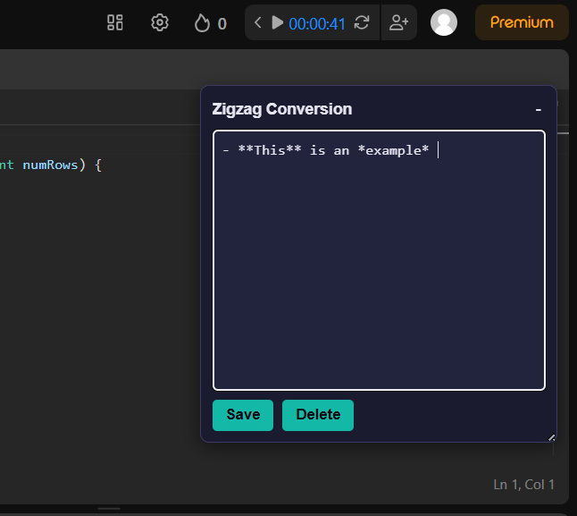
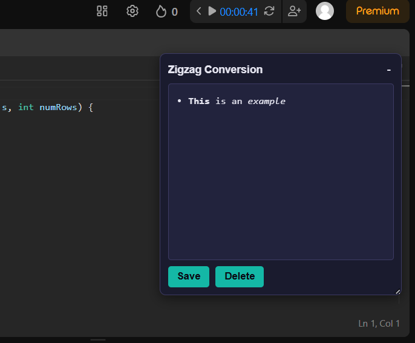
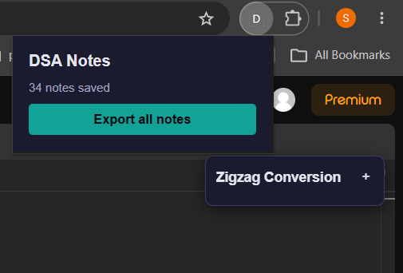
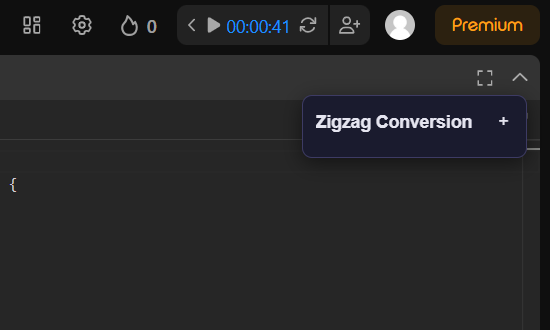

# DSA Notes Extension

A Chromium browser extension for taking notes on DSA questions <br>
Detects when you're on a single question page (LeetCode or Codeforces) <br> 

<table>
   <tr>
      <td></td>
      <td></td>
      <td></td>
      <td></td>
   </tr>
   <tr>
      <td align="center">Edit mode</td>
      <td align="center">Preview mode</td>
      <td align="center">Popup</td>
      <td align="center">Collapsed</td>
   </tr>
</table>

## Requirements

- [Node.js](https://nodejs.org/) (includes npm) — only needed if you want to build from source
- A Chromium-based browser (Chrome, Brave, Edge, etc.)

## Installing without building

If you'd rather not build from source, download a pre-built zip from the
[Releases page](https://github.com/darklord241/notes-extension/releases):

1. Download the zip for the version you want (e.g. `dsa-notes-v2.zip`)
2. Extract it:
   - **Windows**: right-click the zip → **Extract All**
   - **macOS**: double-click the zip — Finder extracts it into a new folder automatically
   - **Linux**: `unzip dsa-notes-v2.zip -d dsa-notes-v2` (a plain `unzip` with no `-d` extracts loose files into your current folder instead of a new one, so `-d` is worth using)

## Setup (build from source)

```bash
npm install
npm run build
```

This produces a `dist/` folder — the actual loadable extension.

## Loading into the browser

1. Open `chrome://extensions`
2. Enable **Developer mode** (toggle, top-right)
3. Click **Load unpacked**
4. Select the `dist/` folder or unzipped folder 
5. Open a question page, e.g. `https://leetcode.com/problems/two-sum/`
   or `https://codeforces.com/problemset/problem/2256/A`

## Keyboard Shortcuts

| Shortcut | Action |
|---|---|
| `Alt + L` | Toggle the panel open/closed. Opening focuses the note and moves the cursor to the end of existing text (or the start, for a fresh question). |
| `Alt + K` | Switch between edit mode (raw markdown) and preview mode (rendered). |

Shortcuts can be changed at `chrome://extensions/shortcuts`.

## Versions

**v1** : 
LeetCode only <br>
Detects question pages, floating panel with plain-text notes <br>
Manual save, `chrome.storage.local` for storage <br> 

**v2** : 
Adds Codeforces support via a per-site adapter pattern <br>
Storage moved to IndexedDB, centralized in the background service worker <br> 
Autosave with a debounced save-on-pause plus a live unsaved/saved status indicator <br>
Panel is now draggable, resizable, and collapsible (collapsed by default), with a keyboard shortcut (Alt+L) to toggle it <br> 

**v3** :
Markdown support with live preview, toggled automatically after a typing pause (debounced, separate from the save timer) <br>
Delete button, wired to the existing storage layer <br>
Extension popup with a note count and one-click export to a single, readable markdown file grouped by site <br>
Cursor automatically moves into the note and to the end of existing text when the panel is expanded or opened on a fresh question <br>
Second keyboard shortcut to switch directly between edit and preview mode <br>

## Inspecting stored notes

Notes are stored in IndexedDB, owned by the extension's background
service worker

1. Go to `chrome://extensions`
2. Click the **"service worker"** link on this extension's card
3. In the DevTools window that opens, go to **Application → IndexedDB → DsaNotesDB → notes**

You will **not** see note data under a LeetCode or Codeforces tab's own
Application panel — IndexedDB opened from a page is scoped to that page's
origin, not the extension. The service worker is the one place with a
consistent view of all stored notes across every supported site.

## Project structure

```
src/
├── background/   — service worker: owns IndexedDB, detects SPA navigation,
│                   handles the keyboard shortcut, answers storage requests
│                   from content scripts via message passing
├── content/      — injected into the page; orchestrates which adapter is
│                   active and renders the notes panel
├── adapters/     — per-site logic: LeetCode, Codeforces (URL parsing,
│                   question ID extraction)
├── storage/      — Dexie/IndexedDB access (background-only) and the
│                   one-time migration from the old per-site local storage
└── shared/       — shared constants (message types)
```

## Status

- [x] Detect LeetCode and Codeforces question pages
- [x] Create / save / load notes, autosave with debounce
- [x] Floating, draggable, resizable, collapsible panel
- [x] Keyboard shortcut to toggle the panel
- [x] IndexedDB storage, centralized in the background service worker
- [x] Markdown support with live preview
- [x] Delete-note UI
- [x] Export notes to a single markdown file
- [x] Keyboard shortcut to switch between edit/preview mode
- [ ] More site adapters (GeeksforGeeks, HackerRank, etc.)
- [ ] Toggleable features (markdown/spellcheck on/off in the popup)
- [ ] Cross-device sync
